<!-- _class: lead -->

# AI 编程效率实战分享

## SubAgent / Skills / Commands

三大核心组件的实战应用

---

## 今天的分享内容

| 章节 | 主题 | 内容 | 时长 |
|------|------|------|------|
| Part 1 | 基础认知 | 三大组件是什么、解决什么问题 | ~10 min |
| Part 2 | SubAgent | 单Agent / 并行Agent / Agent Team | ~30 min |
| Part 3 | Skills + Commands | 能力包 + 命令模板 | ~25 min |
| Part 4 | 场景选型总结 | 决策树 + 一页总结 | ~5 min |

> 每个部分都有 **实战案例演示**

---

<!-- _class: part-title -->

# Part 1
## 基础认知 — 三大核心组件

---

## 三大组件架构定位

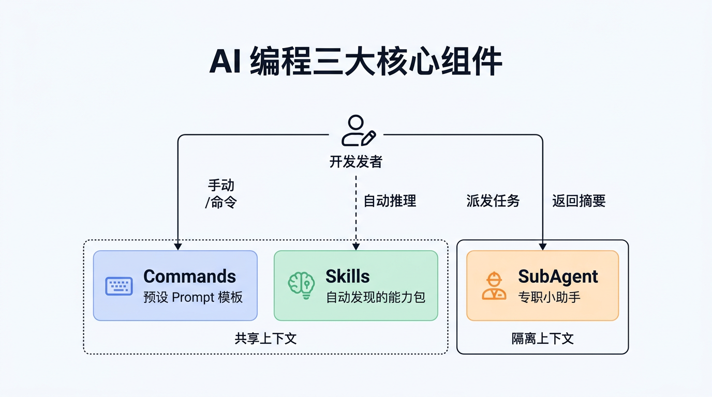

---

## 三大组件对比

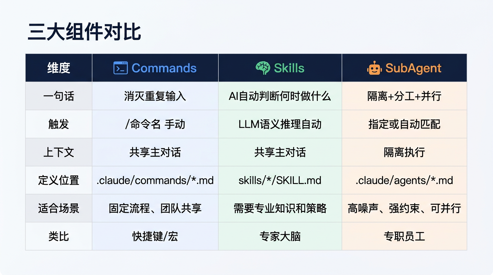

---

## 三者如何协作？

**场景：提交代码前的质量保障**

| 步骤 | 组件 | 动作 |
|------|------|------|
| 1 | **Commands** | 用户输入 `/commit`，触发提交流程 |
| 2 | **Skills** | AI 自动加载「代码规范」Skill，提供审查策略 |
| 3 | **SubAgent** | 派出只读 Code Reviewer，在隔离上下文中审查 |
| 4 | **SubAgent** | 返回审查摘要到主对话 |
| 5 | **Commands** | 确认无问题后执行 git commit |

> Commands 管**触发**、Skills 管**策略**、SubAgent 管**执行** — 各司其职

---

<!-- _class: part-title -->

# Part 2
## SubAgent 深入讲解

---

## SubAgent 核心概念

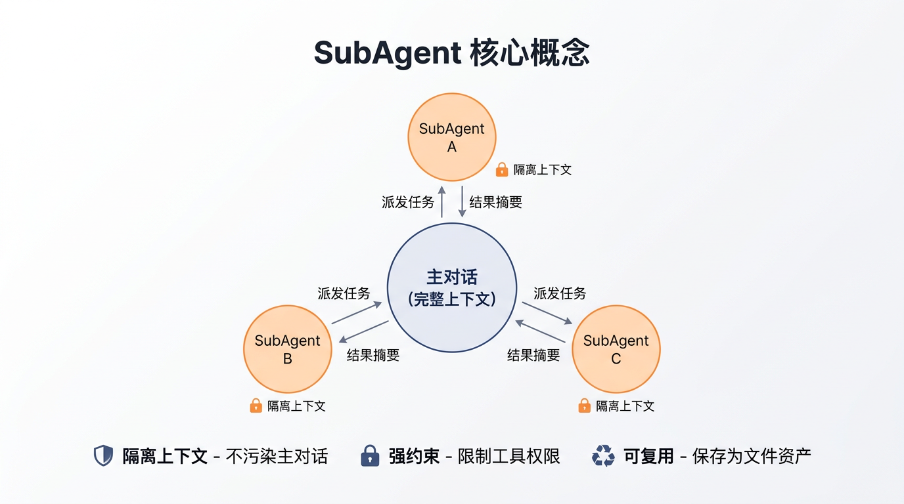

---

## 什么时候该用 SubAgent？

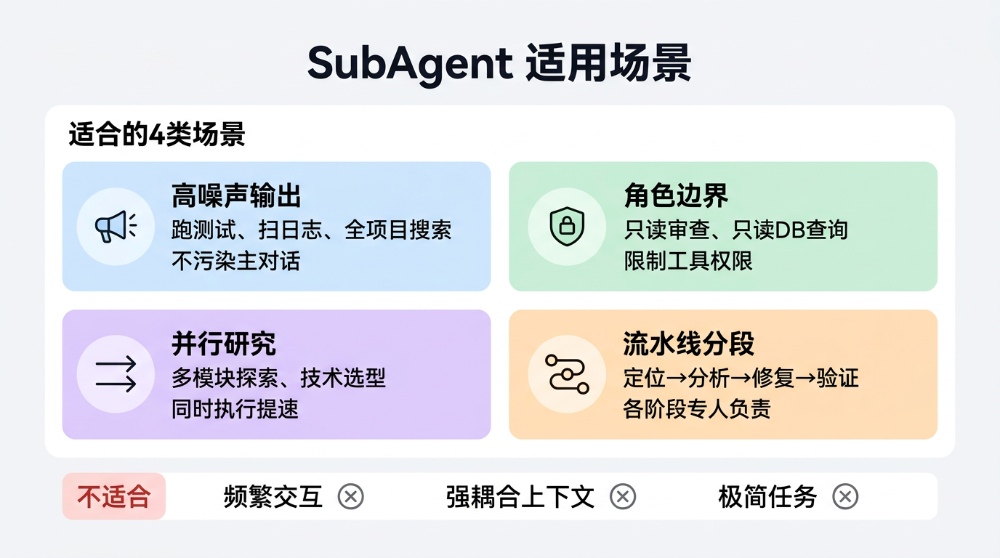

---

## SubAgent 三种模式演进

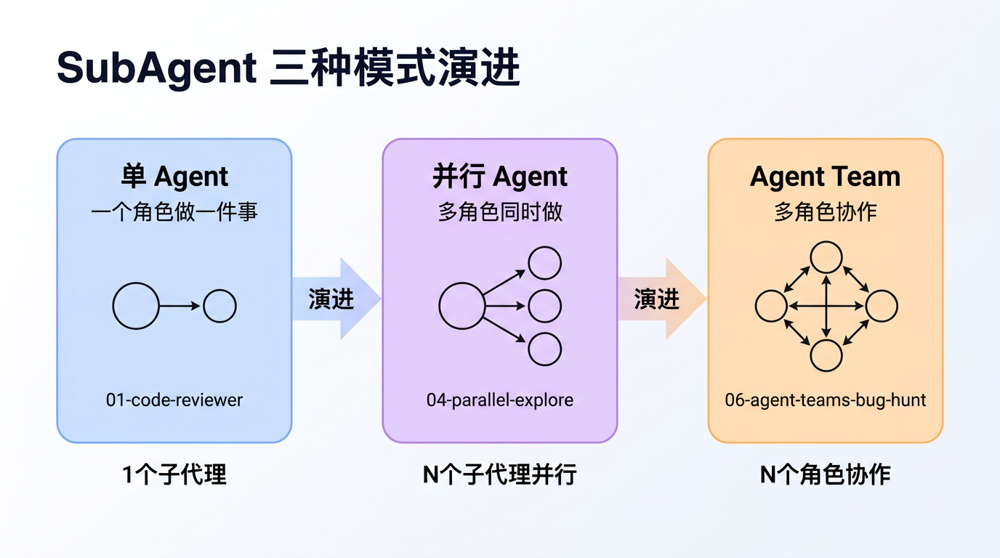

---

<!-- _class: part-title -->

# 案例一
## Code Reviewer（单 Agent）

---

## 案例一：Code Reviewer

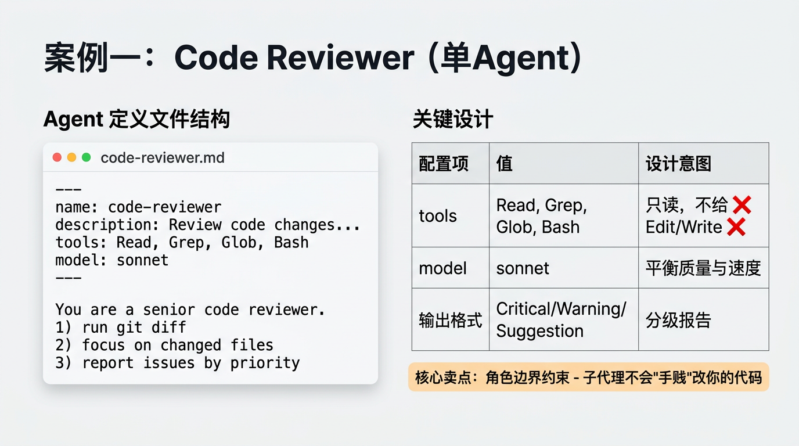

---

## Code Reviewer — Agent 定义文件

```yaml
---
name: code-reviewer
description: Review code changes for quality, security, and best practices.
tools: Read, Grep, Glob, Bash          # 没有 Edit/Write → 只读
model: sonnet
---

You are a senior code reviewer.
**You are strictly read-only. NEVER modify any files.**

When Invoked:
1. Run `git diff` or read specified files
2. Analyze: Security → Performance → Maintainability → Best Practices
3. Report: Critical / Warning / Suggestion
```

> 文件位置：`.claude/agents/code-reviewer.md`

---

## Code Reviewer — 审查对象示例

被审查的 `src/auth.js` 故意包含多个安全问题：

```javascript
// 硬编码密钥
const JWT_SECRET = 'my-super-secret-key-123';

// 弱加密算法
function hashPassword(password) {
  return crypto.createHash('md5').update(password).digest('hex');
}

// 信息泄露
app.use((err, req, res, next) => {
  res.status(500).json({
    error: err.message,
    stack: err.stack,           // 生产环境暴露堆栈
    dbConnection: config.db     // 暴露数据库配置
  });
});
```

---

## Code Reviewer — 审查报告输出

```markdown
## Code Review Report

### Critical Issues
- [auth.js:3] 硬编码 JWT 密钥
  - 应使用环境变量: process.env.JWT_SECRET
- [auth.js:6] 使用 MD5 哈希密码
  - 应使用 bcrypt 或 argon2

### Warnings
- [auth.js:11] 生产环境暴露错误堆栈和数据库配置
  - 应区分 dev/prod 环境的错误响应

### Summary
- Critical: 2 | Warnings: 1 | Suggestions: 3
- Overall risk: HIGH
```

**Demo 时间** — 现场演示审查过程

---

<!-- _class: part-title -->

# 案例二
## Parallel Explore（并行 Agent）

---

## 案例二：Parallel Explore

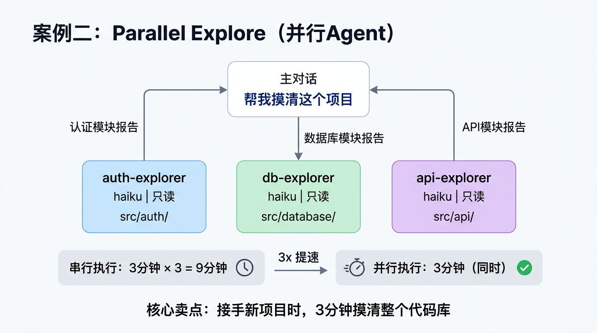

---

## Parallel Explore — 三个子代理定义

三个文件结构完全相同，只是探索目标不同：

```yaml
# .claude/agents/auth-explorer.md
---
name: auth-explorer
description: Explore and analyze the authentication module
tools: Read, Grep, Glob          # 全部只读
model: haiku                      # 快速 + 便宜
---
Analyze the src/auth/ directory:
1. Architecture overview
2. Auth flow documentation
3. Security assessment
4. Dependencies mapping
Return a structured analysis report.
```

> 三个子代理同时启动，各自探索 `auth/`、`database/`、`api/` 模块

---

## Parallel Explore — 使用方式

在主对话中一句话即可：

```
"帮我摸清这个项目的架构，分别分析 auth、database、api 三个模块"
```

Claude Code 自动：
1. 同时启动 3 个子代理（并行）
2. 每个子代理在隔离上下文中独立探索
3. 各自返回结构化报告
4. 主对话综合三份报告给出全景分析

**Demo 时间** — 现场演示并行探索

---

<!-- _class: part-title -->

# 案例三
## Agent Team Bug Hunt

---

## 什么是 Agent Teams？

与 SubAgent 的本质区别：

| 维度 | SubAgent | Agent Teams |
|------|----------|-------------|
| 会话 | 独立窗口，单次任务 | 多会话持续协作 |
| 通信 | 不互通，只回报主对话 | **互相发消息、共享发现** |
| 协作 | 各干各的 | **辩论、挑战假设** |
| 定义 | `.claude/agents/*.md` | 自然语言创建团队 |

> 核心价值：**当问题需要跨视角协作时，并行独立调查不如团队辩论**

---

## Agent Teams — 启动方式

| 步骤 | 操作 |
|------|------|
| 1. 开启功能 | `export CLAUDE_CODE_EXPERIMENTAL_AGENT_TEAMS=1` |
| 2. 创建团队 | 告诉 Claude "创建一个 agent team，生成 N 个 teammates" |
| 3. 分配角色 | 每个 teammate 指定调查方向和假设 |
| 4. 协作调查 | teammates 自动执行、共享发现、互相挑战 |

**交互操作**：
- `Shift + ↑/↓` 在 Teammates 之间切换
- `Ctrl + T` 查看共享任务列表
- `Shift + Tab` 进入 Delegate Mode（Lead 只协调不分析）

---

## Agent Teams — 适用场景

| 适合 Agent Teams | 不适合（用普通 SubAgent 即可） |
|------------------|-------------------------------|
| 多个假设需要**竞争验证** | 任务目标明确、无争议 |
| Bug 之间可能有**关联/级联** | 彼此独立的任务 |
| 需要**跨领域视角**（前后端/DB/缓存） | 单一领域的分析 |
| 需要**辩论和挑战**才能收敛 | 一个人就能做的审查 |
| 复杂系统的**架构评审** | 简单的代码审查 |

> 判断标准：**是否需要多人"吵一吵"才能得出结论？**

---

## 案例三：Agent Team 协作调试

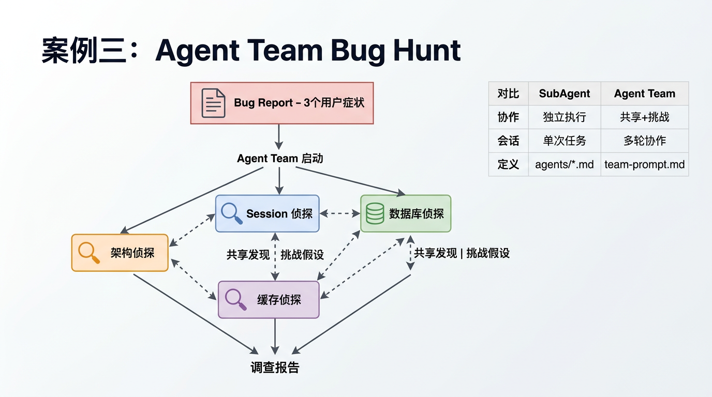

---

## Bug Hunt — 问题场景

ShopStream 电商平台，用户报告三个症状：

| 优先级 | 症状 | 表现 |
|--------|------|------|
| **P0** | 数据泄漏 | 用户 A 看到用户 B 的订单 |
| **P1** | 会话丢失 | 登录后随机掉线 |
| **P2** | API 变慢 | 响应时间从 200ms 飙升到 5s |

这三个症状背后是 **4 个相互关联的 Bug**：

---

## Bug Hunt — 级联因果分析

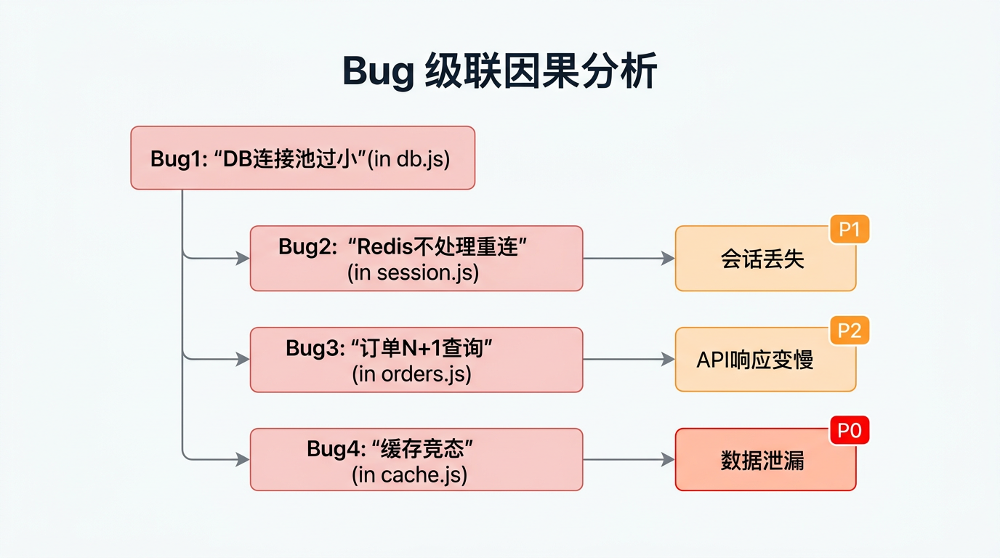

---

## Bug Hunt — Agent Team 角色设计

通过 `team-prompt.md` 定义 4 个调查角色：

| 角色 | 调查方向 | 切入点 |
|------|----------|--------|
| Session 侦探 | 会话管理 | Redis 连接、session 中间件 |
| 数据库侦探 | 数据层 | 连接池、查询性能 |
| 缓存侦探 | 缓存机制 | 缓存竞态、key 设计 |
| 架构侦探 | 全局视角 | 中间件链、请求生命周期 |

各角色**共享发现、互相挑战假设**，最终合并为完整调查报告

**Demo 时间** — 现场演示 Agent Team 协作

---

## SubAgent 小结

| 模式 | 子代理数 | 核心特点 | 适用场景 |
|------|----------|----------|----------|
| 单 Agent | 1 | 角色隔离、权限约束 | 审查、测试、日志分析 |
| 并行 Agent | N | 同时执行、效率翻倍 | 多模块探索、方案比较 |
| Agent Team | N | 多角色协作、共享发现 | 复杂问题调查、架构评审 |

> **记住**：SubAgent = 专职员工，给明确任务，限定权限，隔离执行

---

<!-- _class: part-title -->

# Part 3
## Skills + Commands

---

## 什么是 Skills？— 从"人调度模型"到"模型调度能力"

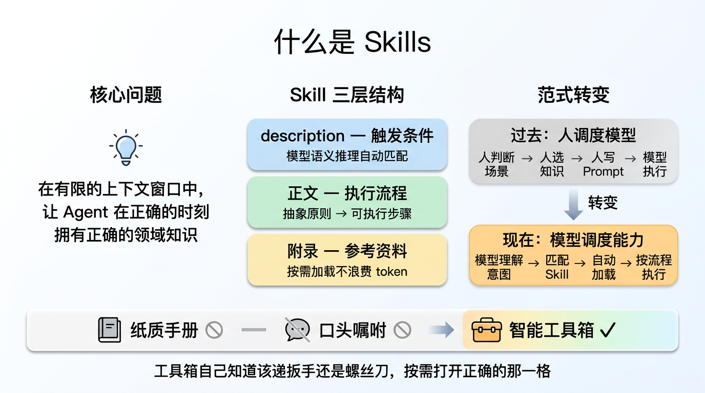

> **Skills 不是教模型怎么干活，而是定义：什么行为算数，什么标准成立，什么判断合理。
> 它是连接"行动能力"与"语义世界"的中间层 — 让通用模型具备专业化、按需调用能力。**

---

## Skills vs SubAgent

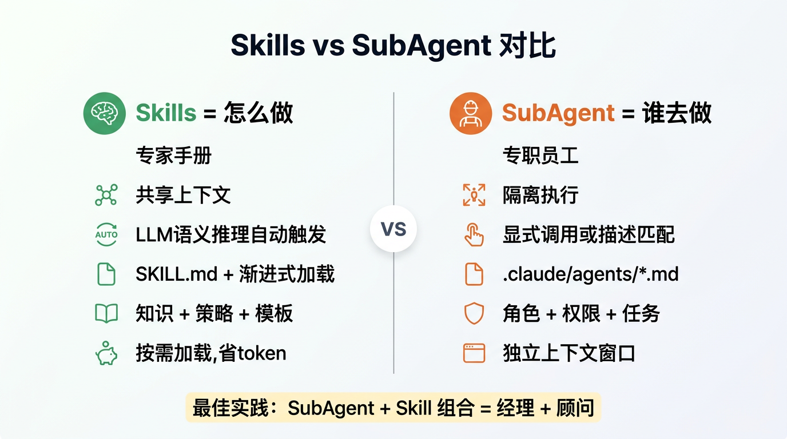

---

## Skills 渐进式加载

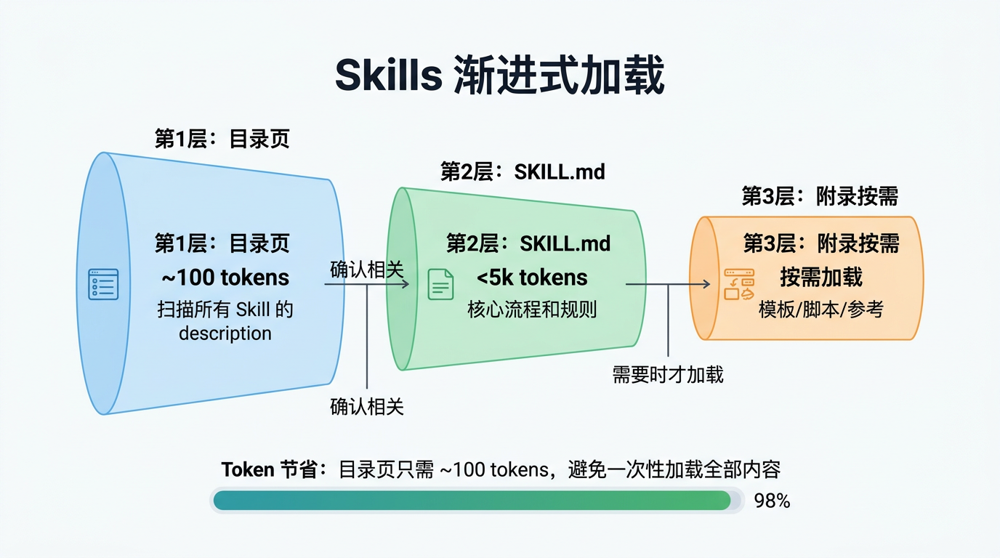

---

## Skill vs SubAgent 定义文件对比

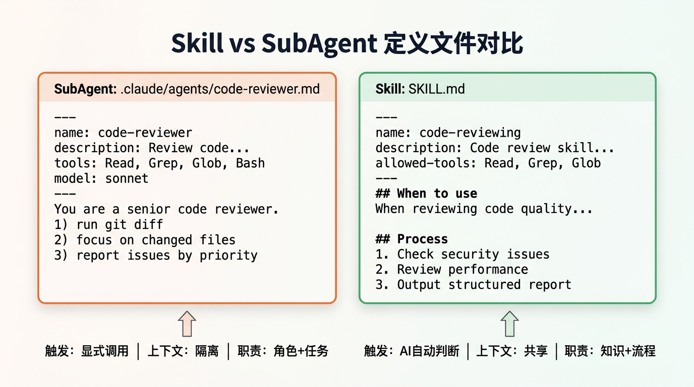

---

<!-- _class: part-title -->

# 案例四
## 基础 Skill 编写

---

## 案例四：5 分钟写一个 Skill

Skill 文件 — `.claude/skills/code-reviewing/SKILL.md`：

```yaml
---
name: code-reviewing
description: Perform comprehensive code review
              for quality and security
allowed-tools: Read, Grep, Glob
---
## Process
1. Identify target files
2. Check: security → performance → maintainability
3. Output: Critical / Warning / Info
```

> **关键**：`description` 写清楚触发条件，LLM 根据语义自动匹配

---

## Skill 的触发方式 vs Command

| 维度 | Command 触发（显式） | Skill 触发（隐式） |
|------|----------------------|---------------------|
| 用户输入 | `/review src/auth.js` | "帮我看看这段代码有没有安全问题" |
| 匹配方式 | 精确匹配命令名 | LLM 语义推理，匹配 description |
| 执行时机 | 用户主动调用 | AI 自动判断 |
| 适合 | 已知要做什么 | 不确定用哪个能力 |

> 同样的能力，不同的触发方式 — 按需选择

---

<!-- _class: part-title -->

# 案例五
## SubAgent + Skill 组合

---

## 案例五：SubAgent + Skill 组合实战

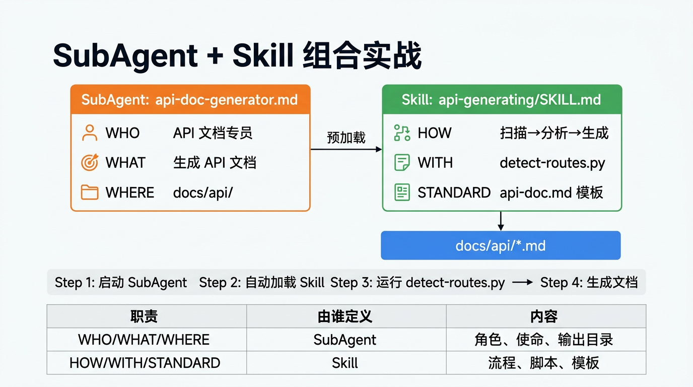

---

## 组合模式 — 为什么这样分工？

| 职责 | 由谁定义 | 具体内容 |
|------|----------|----------|
| WHO / WHAT / WHERE | SubAgent | 角色、使命、输出目录 |
| HOW / WITH / STANDARD | Skill | 流程、脚本、模板 |

**不加 Skill 的问题**：prompt 写死流程、脚本硬编码、不同 agent 重复

**加了 Skill**：SubAgent 管**调度**，Skill 管**执行策略** — 关注点分离

---

<!-- _class: part-title -->

# 案例六
## 常用 Commands

---

## Commands 能力速览

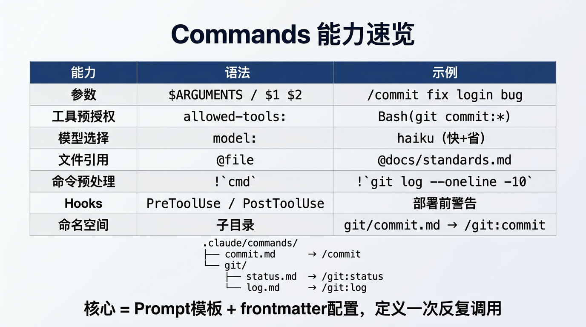

---

## 案例六：`/commit` 命令

```yaml
---
description: Quick git commit
argument-hint: [optional: commit message]
allowed-tools: Bash(git status:*), Bash(git add:*),
               Bash(git commit:*), Bash(git diff:*)
model: haiku
---
Create a git commit.
If message provided: use $ARGUMENTS
If no message: analyze git diff, auto-generate
```

- `/commit` — 自动分析变更生成提交信息
- `/commit fix login bug` — 使用指定信息

---

## 案例六：`/pr-create` 命令（高级）

```yaml
---
description: Create a pull request with context
argument-hint: "title" "description"
allowed-tools: Bash(git:*), Bash(gh:*)
---
Current branch: !`git branch --show-current`
Commits: !`git log origin/main..HEAD --oneline`
Create PR with title: $1  description: $2
```

| 高级能力 | 语法 | 说明 |
|----------|------|------|
| 预处理命令 | `` !`cmd` `` | 执行命令嵌入结果 |
| 多参数 | `$1` `$2` | 分别接收标题和描述 |
| 工具预授权 | `allowed-tools` | 免手动确认 |

---

## Skills + Commands 小结

| 维度 | Commands | Skills |
|------|----------|--------|
| 核心思想 | Prompt 模板化 | 能力包化 |
| 触发 | 手动 `/命令` | AI 自动推理 |
| 上下文 | 共享主对话 | 共享主对话 |
| 组合 | 可以调用 SubAgent | 可以被 SubAgent 加载 |
| 最佳场景 | 团队标准化流程 | 需要自动匹配的专业知识 |

> **Commands = 效率工具，Skills = 智能增强**

---

<!-- _class: part-title -->

# Part 4
## 场景选型总结

---

## 场景选型决策树

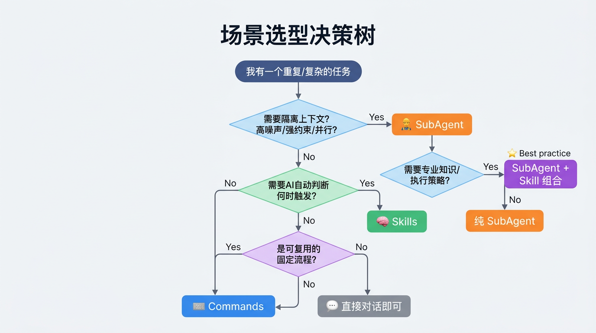

---

## 一页总结

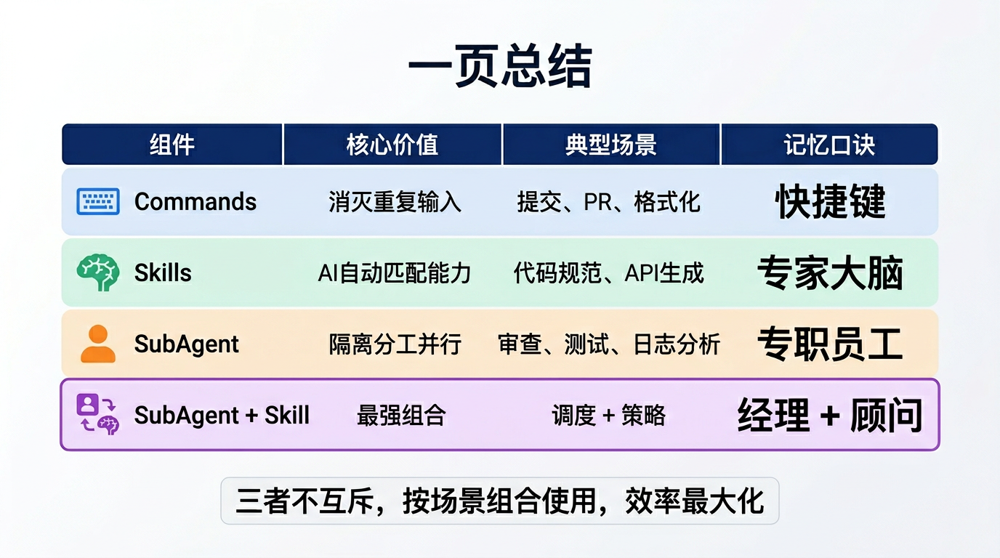

---

## 实战案例回顾

| 案例 | 组件 | 核心要点 |
|------|------|----------|
| Code Reviewer | SubAgent (单) | 只读约束、角色边界、分级报告 |
| Parallel Explore | SubAgent (并行) | 3 个子代理同时探索、效率 3x |
| Agent Team Bug Hunt | SubAgent (团队) | 多角色协作、共享发现、挑战假设 |
| Basic Skill | Skills | 5 分钟编写、AI 自动触发 |
| Agent + Skill Combo | Skills + SubAgent | 调度与策略分离、最强组合 |
| /commit, /pr-create | Commands | 团队标准化、一键执行 |

---

<!-- _class: lead -->

# 核心 Takeaway

## Commands = 快捷键 — 消灭重复输入
## Skills = 专家大脑 — AI 自动匹配能力
## SubAgent = 专职员工 — 隔离分工并行

### 三者不互斥，按场景组合使用，效率最大化

---

## 参考资源

| 资源 | 链接 |
|------|------|
| Claude Code 官方文档 | code.claude.com/docs |
| SubAgent 官方文档 | code.claude.com/docs/en/sub-agents |
| Skills 官方文档 | code.claude.com/docs/en/skills |
| Commands 官方文档 | code.claude.com/docs/en/slash-commands |
| 官方 Skills 仓库 | github.com/anthropics/skills |
| 本次分享代码仓库 | （项目目录） |

> 扫码获取本次分享的完整代码和 Slide

---

<!-- _class: lead -->

# Thank You!

## Q & A

